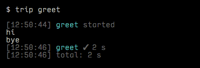

# trip.js [![NPM version][npm-image]][npm-url] [![Build Status][travis-image]][travis-url] [![Dependency Status][depstat-image]][depstat-url]

**trip** is a simple task runner.

It doesn't include utilities for reading/writing files or transforming data. It's not a build system.

## install

```sh
$ npm install --global trip
```

## usage

### getting started

#### 1. install a local copy of trip in your project

```sh
$ cd some/project
$ npm install --save-dev trip
```

#### 2. create a `tripfile.js` at the root of your project

Export some functions. These are your tasks. Follow the usual Node pattern: take a `done` callback, and call it when you're done. (And pass it an error if something went wrong.).

```js
exports.greet = function (done) {
  console.log('hi');

  setTimeout(function () {
    console.log('bye');
    done();
  }, 2000);
};
```

#### 3. run tasks from the command line



### example

This tripfile exports four tasks:

```js
var coffee = require('coffee-script'),
    sass = require('node-sass'),
    fs = require('fs'),
    Imagemin = require('imagemin'),
    glob = require('glob');

exports.scripts = function (done) {
  fs.readFile('app/scripts/main.coffee', function (err, js) {
    if (err) return done(err);

    var js = coffee.compile();
    fs.writeFile('dist/scripts/main.js', js, done);
  });
};

exports.styles = function (done) {
  sass.renderFile({
    file: 'app/scripts/main.scss',
    outFile: 'dist/scripts/main.css',
    success: function (file) {
      console.log('rendered', file);
      done();
    },
    error: done
  });
};

exports.images = function (done) {
  glob('app/**/*.{png,jpg}', function (err, files) {
    if (err) return done(err);

    async.each(files, function (file, done) {
      new Imagemin()
        .src(file)
        .dest(file.replace('app', 'dist'))
        .optimize(done);
    }, done);
  });
};

exports.inline = function (done) {
  var embedder = new ResourceEmbedder('app/index.html');
  embedder.get(function (markup) {
    fs.writeFile('dist/index.html', markup, done);
  });
};
```

With this tripfile, you can run `$ trip images` to compile all your images, for example.

You can also do `$ trip scripts styles images inline` to perform all four named tasks. To avoid typing all that every time, use **subtasks**.

### subtasks

A task can be defined as an **array** of other tasks:

```js
exports.build = ['scripts', 'styles', 'images', 'inline'];
```

Now you can do `$ trip build` to run all four tasks, in series.

You can also use **inline functions** directly in an array:

```js
exports.things = [
  'foo',

  function (done) {
    console.log('this runs between foo and bar');
    done();
  },

  'bar'
];
```

### parallel tasks

Use a **nested array** to run subtasks in parallel:

```js
exports.build = [ ['styles', 'scripts', 'images'], 'inline' ];
```

Now `$ trip build` does the same thing as the CLI example above, starting `inline` as soon as the three parallel tasks have all completed.

> Each level of nesting reverses the series:parallel decision, so you can do complex, over-engineered stuff if you want. Probably only useful in obscure cases.

### task arguments

You can set arguments (only strings) using **colons** as delimiters:

```sh
$ trip say:otters:ducks
```

```js
exports.say = function (msg1, msg2, msg3, done) {
  console.log(msg1); // otters
  console.log(msg2); // ducks
  console.log(msg3); // null
  done();
};
```

Note only two arguments were specified, so `msg3` is `null`. This doesn't cause a problem; the `done` callback is always passed as the final argument that your function accepts.

## license

[The MIT License](http://opensource.org/licenses/MIT)

<!-- badge URLs -->
[npm-url]: https://npmjs.org/package/trip
[npm-image]: https://img.shields.io/npm/v/trip.svg?style=flat-square

[travis-url]: http://travis-ci.org/callumlocke/trip
[travis-image]: https://img.shields.io/travis/callumlocke/trip.svg?style=flat-square

[depstat-url]: https://david-dm.org/callumlocke/trip
[depstat-image]: https://img.shields.io/david/callumlocke/trip.svg?style=flat-square
